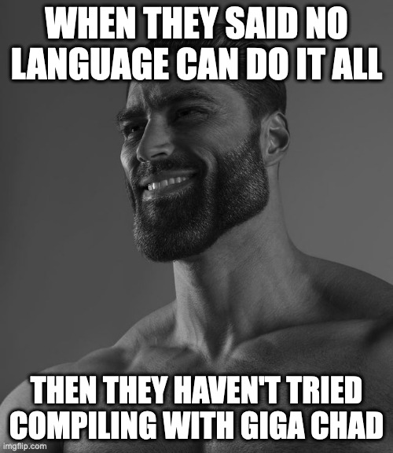

# Bachelor - Giga Chad Compiler

  

  
  

#### Design Philosophy: 
- **Effortless Superiority**: Why struggle with other languages when you can dominate with Giga Chad? It's not just a language; it's a power move. Designed for those who write code not just to solve problems, but to flex on runtime inefficiencies and syntax complexities.

- **Brute Simplicity**: Giga Chad doesn't do 'complex' or 'verbose'. If a task needs more than 10 lines of .chad code, you're clearly not using Giga Chad to its full potential. Our motto: "Why be complicated when you can be Giga Chad?"

- **Unapologetic Speed**: Slow compilation? Never heard of her. Giga Chad compiles at the speed of your ambition, leaving other languages in the dust. Perfect for coding at 3 AM and still getting eight hours of sleep because, let's face it, even Giga Chads need their beauty rest.

## Installation

1. Download the repository
2. `cd` into the directory
3. `mkdir build && cd build`
3. Run CMake: `cmake ..`
4. Run make: `make`

## Usage

Run `prog.out`. If you are already in the directory, you can run `./prog.out` to do this.

## Testing

1. `cd build`
    - If the directory doens't exist, make it with `mkdir build`
2. `cmake ..`
3. `make tests`
    - Alternatively, you can run `make` instead to make all files which would include the test files
4. `ctest`

